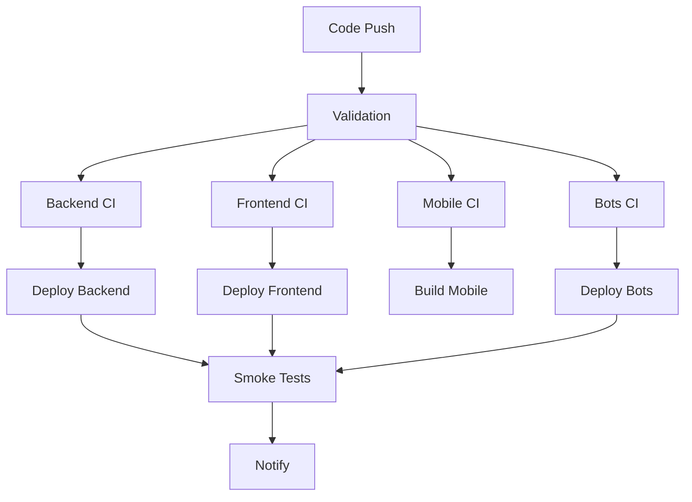

# 🏢 Tayank Organization


*Bu görseli daha sonra gerçek bir banner ile değiştirebilirsiniz*

## 👋 Hoş Geldiniz

[Tayank](https://tayank.com) modern web ve mobil uygulama geliştirme için oluşturulmuş bir organizasyondur. Bu repository, Tayank organizasyonundaki tüm projeler için merkezi konfigürasyon dosyalarını içerir.

## 📂 Repository Yapısı

```plaintext
.github/
├── 📁 workflows/           # Reusable GitHub Actions
├── 📁 ISSUE_TEMPLATE/     # Issue şablonları
├── 📁 PULL_REQUEST_TEMPLATE/ # PR şablonları
├── 📄 CODE_OF_CONDUCT.md  # Davranış kuralları
├── 📄 CONTRIBUTING.md     # Katkıda bulunma rehberi
├── 📄 SECURITY.md         # Güvenlik politikası
├── 📄 SUPPORT.md          # Destek rehberi
└── 📄 FUNDING.yml         # Sponsorluk bilgileri
```

## 🛠️ Workflow'lar (GitHub Actions)

### ♻️ Reusable Workflow'lar
- **`reusable-metrics-ci.yml`** - Proje metriklerini toplar
- **`reusable-release-drafter.yml`** - Otomatik sürüm notları oluşturur
- **`reusable-monorepo-ci.yml`** - Monorepo CI/CD işlemleri

### 🚀 Service-Specific Workflow'lar
- **Backend (Go)** - Test, build ve deployment
- **Frontend (Bun/Next.js)** - Test, build ve Vercel deployment
- **Mobile (Flutter)** - Test, build ve store hazırlık
- **Bots (Python/Node.js)** - Test ve deployment

## 📋 Template'ler

### 🐛 Issue Template'leri
- **Bug Report** - Hata bildirim şablonu
- **Feature Request** - Özellik talebi şablonu
- **Security Vulnerability** - Güvenlik açığı bildirimi

### 🔄 Pull Request Template
Standardize edilmiş PR şablonu:
- Değişiklik açıklaması
- Test bilgileri
- Ekran görüntüleri
- Checklist

## 📚 Dokümantasyon

### 🎯 Hızlı Başlangıç
```bash
# Repository'yi klonla
git clone https://github.com/Tayank-LTD/.github.git

# Gerekli dosyaları projenize kopyalayın
cp -r .github/* your-project/.github/
```

### 🔧 Kurulum
1. Bu template'leri kullanmak için repository'nizde `.github` klasörü oluşturun
2. İlgili dosyaları bu repository'den kopyalayın
3. Environment variables ve secrets'ları ayarlayın

## 🌐 Projelerimiz

### 🎯 Ana Projeler
| Proje | Açıklama | Teknoloji |
|-------|-----------|-----------|
| [Tayank Backend](https://github.com/Tayank-LTD/backend) | API servisleri | Go, PostgreSQL |
| [Tayank Frontend](https://github.com/Tayank-LTD/frontend) | Web arayüzü | Next.js, Bun |
| [Tayank Mobile](https://github.com/Tayank-LTD/mobile) | Mobil uygulama | Flutter |
| [Tayank Bots](https://github.com/Tayank-LTD/bots) | Chatbot'lar | Python, Node.js |

### 🔧 Yardımcı Araçlar
- **Tayank CLI** - Geliştirici araçları
- **Tayank Design System** - UI component kütüphanesi
- **Tayank Analytics** - Analiz ve metrik toplama

## 🚀 CI/CD Pipeline



## 🔐 Environment Variables

Workflow'lar için gerekli environment variables:

```yaml
# Repository Secrets
VERCEL_TOKEN: "xxx"
KUBECONFIG: "xxx"
BACKEND_DEPLOY_TOKEN: "xxx"
MOBILE_DEPLOY_TOKEN: "xxx"
BOTS_DEPLOY_TOKEN: "xxx"
PRODUCTION_DATABASE_URL: "xxx"

# Repository Variables  
NODE_VERSION: "20"
PYTHON_VERSION: "3.11"
GO_VERSION: "1.21"
FLUTTER_VERSION: "3.13.x"
BUN_VERSION: "latest"
```

## 🤝 Katkıda Bulunma

Katkıda bulunmak için lütfen:
1. [CONTRIBUTING.md](CONTRIBUTING.md) dosyasını okuyun
2. Bir issue açın veya mevcut issue'ları inceleyin
3. Pull request gönderin

### 🐛 Hata Bildirimi
1. [Issue template](.github/ISSUE_TEMPLATE/bug_report.md) kullanın
2. Açıklayıcı başlık ve detaylı açıklama ekleyin
3. Mümkünse ekran görüntüsü veya log ekleyin

### 💡 Özellik Önerisi
1. [Feature request template](.github/ISSUE_TEMPLATE/feature_request.md) kullanın
2. Problemi ve çözüm önerinizi açıklayın
3. Alternatif çözümleri belirtin

## 📞 Destek

### 🆘 Yardım Alma
- **Documentation**: [docs.tayank.com](https://docs.tayank.com)
- **Issues**: [GitHub Issues](https://github.com/Tayank-LTD/.github/issues)
- **Email**: [hello@tayank.com](mailto:hello@tayank.com)

### 🔒 Güvenlik
Güvenlik açığı bildirimi için lütfen [SECURITY.md](SECURITY.md) dosyasını okuyun.

## 📊 Metrikler


## 📄 Lisans

Bu repository'nin içeriği [Creative Commons Attribution 4.0 International](https://creativecommons.org/licenses/by/4.0/) lisansı ile lisanslanmıştır.

Bireysel Tayank projeleri farklı lisanslara sahip olabilir - her repository'nin LICENSE dosyasını kontrol edin.

---

<div align="center">

## 🌟 Bizi Destekleyin

Projelerimizi beğeniyorsanız yıldız ⭐ vererek destek olabilirsiniz!

[](https://star-history.com/#Tayank-LTD/tayank&Tayank-LTD/backend&Tayank-LTD/frontend&Date)

**Tayank ekibi tarafından ❤️ ile oluşturuldu**

[🌐 Website](https://tayank.com) • 
[🐦 Twitter](https://twitter.com/tayankapp) • 
[📧 Contact](mailto:hello@tayank.com)

</div>