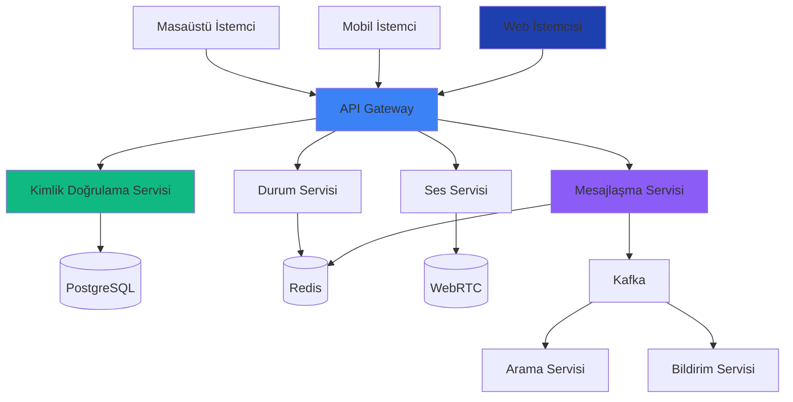

<div align="center">


# 🚀 Tayank

### Discord + Slack Hibrit İletişim Platformu

**Modern, ölçeklenebilir ve zengin özellikli takım ve topluluk iletişimi**

[](https://tayank.com)
[](https://docs.tayank.com)
[](https://github.com/Tayank-LTD/tayank/blob/main/LISANS)

[](https://github.com/Tayank-LTD/tayank/issues)
[](https://github.com/Tayank-LTD/tayank/pulls)
[](https://github.com/Tayank-LTD/tayank/graphs/contributors)

</div>

---

## 💡 Tayank Nedir?

Tayank, **Discord**'un (oyun, topluluk) ve **Slack**'in (iş, verimlilik) en iyi özelliklerini tek bir güçlü platformda birleştirir:

- 🎮 **Oyun odaklı** - Düşük gecikmeli ses, zengin durum, oyun entegrasyonları
- 💼 **İş için hazır** - Çalışma alanları, thread'ler, entegrasyonlar, proje yönetimi
- 🔒 **Gizlilik odaklı** - Özel mesajlar için uçtan uca şifreleme
- ⚡ **Yüksek performans** - Go ile geliştirildi, 1M+ eşzamanlı kullanıcı için optimize edildi
- 🌍 **Açık ekosistem** - Herkese açık SDK'lar, bot platformu, kapsamlı API'lar

---

## 🏗️ Mimarı Genel Bakış



## 📦 Projelerimiz

### 🔧 Backend Servisleri

| Servis | Açıklama | Durum |
|---------|-------------|--------|
| [auth-service](https://github.com/Tayank-LTD/auth-service) | Kimlik doğrulama & yetkilendirme | 🚧 Geliştirme Aşamasında |
| [messaging-service](https://github.com/Tayank-LTD/messaging-service) | Gerçek zamanlı mesajlaşma | 🚧 Geliştirme Aşamasında |
| [voice-service](https://github.com/Tayank-LTD/voice-service) | Ses & video görüşmeleri (WebRTC) | 🚧 Geliştirme Aşamasında |
| [media-service](https://github.com/Tayank-LTD/media-service) | Dosya depolama & CDN | 📋 Planlanıyor |
| [presence-service](https://github.com/Tayank-LTD/presence-service) | Kullanıcı durumu & aktivite | 📋 Planlanıyor |
| [notification-service](https://github.com/Tayank-LTD/notification-service) | Push bildirimleri | 📋 Planlanıyor |
| [search-service](https://github.com/Tayank-LTD/search-service) | Arama (Elasticsearch) | 📋 Planlanıyor |
| [moderation-service](https://github.com/Tayank-LTD/moderation-service) | İçerik moderasyonu (AI) | 📋 Planlanıyor |
| [analytics-service](https://github.com/Tayank-LTD/analytics-service) | Analiz & metrikler | 📋 Planlanıyor |
| [billing-service](https://github.com/Tayank-LTD/billing-service) | Ödemeler & abonelikler | 📋 Planlanıyor |
| [api-gateway](https://github.com/Tayank-LTD/api-gateway) | API Gateway & yönlendirme | 🚧 Geliştirme Aşamasında |

### 🎨 Frontend Uygulamaları

| Uygulama | Açıklama | Platform |
|-----|-------------|----------|
| [web](https://github.com/Tayank-LTD/web) | Web uygulaması | Next.js 15 |
| [mobile](https://github.com/Tayank-LTD/mobile) | Mobil uygulama | Flutter |
| [landing](https://github.com/Tayank-LTD/landing) | Tanıtım websitesi | Next.js |

### 📚 Paylaşılan Kütüphaneler

| Paket | Açıklama | Dil |
|---------|-------------|----------|
| [proto](https://github.com/Tayank-LTD/proto) | Protocol Buffers (gRPC) | Proto |
| [shared-go](https://github.com/Tayank-LTD/shared-go) | Go yardımcıları | Go |
| [shared-ts](https://github.com/Tayank-LTD/shared-ts) | TypeScript yardımcıları | TypeScript |
| [ui-components](https://github.com/Tayank-LTD/ui-components) | React component kütüphanesi | React |
| [sdk](https://github.com/Tayank-LTD/sdk) | İstemci SDK'ları (JS, Python, Go) | Çoklu dil |

### 🏠 Ana Repository

| Repository | Açıklama |
|------------|-------------|
| [tayank](https://github.com/Tayank-LTD/tayank) | Ana orkestrasyon reposu (altyapı, dokümanlar, docker-compose) |

---

## 🚀 Hızlı Başlangıç

### Geliştiriciler İçin

```bash
# Ana repoyu klonla
git clone https://github.com/Tayank-LTD/tayank.git
cd tayank

# Yerel geliştirme ortamını başlat
docker-compose up -d

# Erişim:
# - Web: http://localhost:3000
# - API: http://localhost:8080
# - Dokümanlar: http://localhost:8000
```

### Kullanıcılar İçin

- 🌐 **Web**: [app.tayank.com](https://app.tayank.com) (Yakında)
- 📱 **iOS**: Yakında
- 🤖 **Android**: Yakında
- 💻 **Masaüstü**: Yakında

---

## 📚 Kaynaklar

- 📖 [Dokümantasyon](https://docs.tayank.com) - Tam kılavuzlar ve API referansı
- 🎓 [Geliştirici Rehberleri](https://docs.tayank.com/guides) - Botlar ve entegrasyonlar geliştirin
- 🔌 [API Referansı](https://api.tayank.com/docs) - REST & WebSocket API'ları
- 🤖 [Bot Geliştirme](https://docs.tayank.com/bots) - Güçlü botlar oluşturun

---

## 🤝 Katkıda Bulunma

Topluluk katkılarını memnuniyetle karşılıyoruz!

**Katkıda bulunmadan önce:**
1. [Katkıda Bulunma Rehberi](https://github.com/Tayank-LTD/.github/blob/main/CONTRIBUTING.md)'mizi okuyun
2. [Davranış Kuralları](https://github.com/Tayank-LTD/.github/blob/main/CODE_OF_CONDUCT.md)'mızı kontrol edin
3. [`good first issue`](https://github.com/search?q=org%3ATayank-LTD+label%3A%22good+first+issue%22+state%3Aopen&type=Issues) etiketli issue'ları arayın

**Nasıl katkıda bulunabilirsiniz:**
- 🐛 [Hata bildirin](https://github.com/Tayank-LTD/tayank/issues/new?template=bug_report.yml)
- ✨ [Özellik isteyin](https://github.com/Tayank-LTD/tayank/issues/new?template=feature_request.yml)
- 📝 Dokümantasyonu iyileştirin
- 🔧 Pull request gönderin

---

## 🛡️ Güvenlik

Güvenlik bizim en yüksek önceliğimizdir. Bir güvenlik açığı keşfederseniz:

**🚨 Lütfen HALK AÇIK bir issue AÇMAYIN!**

Bunun yerine lütfen:
- E-posta gönderin: [security@tayank.com](mailto:security@tayank.com)
- [Güvenlik Politikası](https://github.com/Tayank-LTD/.github/blob/main/SECURITY.md)'mızı okuyun

---

## 📊 Proje Durumu

| Metrik | Durum |
|--------|--------|
| Versiyon | v0.1.0-alpha (MVP geliştirme aşamasında) |
| Servisler | 11 planlandı, 3'ü geliştirme aşamasında |
| Test Kapsamı | Hedef: %80+ |
| Dokümantasyon | Devam ediyor |
| Halka Açık Lansman | 2025 Q2 (tahmini) |

---

## 🌟 Özellik Yol Haritası

### V1.0 - MVP (Mevcut)
- ✅ Metin kanalları & Özel mesajlar
- ✅ Ses kanalları
- ✅ Temel roller & izinler
- ✅ Dosya paylaşımı
- 🚧 Gerçek zamanlı mesajlaşma
- 🚧 Kullanıcı kimlik doğrulama

### V2.0 - Gelişmiş
- 📋 Video yayını
- 📋 Ekran paylaşımı
- 📋 Thread'ler
- 📋 Forum kanalları
- 📋 Botlar & webhook'lar
- 📋 Mobil uygulamalar

### V3.0 - Kurumsal
- 📋 Çalışma alanları (iş katmanı)
- 📋 Gelişmiş analitik
- 📋 SSO entegrasyonu
- 📋 Uyumluluk özellikleri

---

## 📞 İletişim

- 🌐 Website: [tayank.com](https://tayank.com)
- 📧 E-posta: [hello@tayank.com](mailto:hello@tayank.com)
- 🐦 Twitter: [@tayankapp](https://twitter.com/tayankapp)
- 📺 YouTube: [Tayank Official](https://youtube.com/@tayank)

---

## 📄 Lisans

Projelerimizin çoğu [MIT Lisansı](https://github.com/Tayank-LTD/tayank/blob/main/LISANS) altında lisanslanmıştır.

Bireysel repository'ler farklı lisanslara sahip olabilir - lütfen her repo'nun LISANS dosyasını kontrol edin.

---

## ❤️ Sponsorlar

Tayank'ı mümkün kılan sponsorlarımıza minnettarız:

<!-- Sponsors bölümü - daha sonra doldurulacak -->
*Sponsor olun ve iletişimin geleceğini inşa etmemize yardım edin!*

---

<div align="center">

**Tayank ekibi tarafından ❤️ ile geliştirilmiştir**

[⭐ GitHub'da bizi yıldızlayın](https://github.com/Tayank-LTD) • [📖 Dokümanları okuyun](https://docs.tayank.com)


</div>
